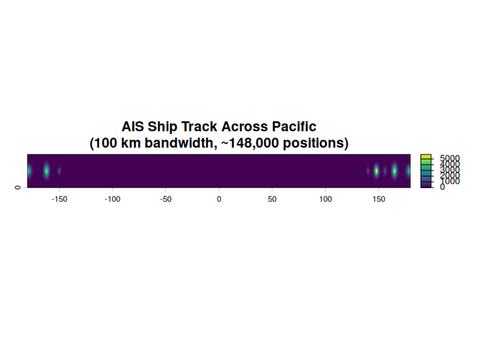

<!-- README.md is generated from README.Rmd. Please edit that file -->

# geodensity

<!-- badges: here -->

Fast kernel density estimation on geographic grids using geodesic
(great-circle) distances.

## Why geodesic KDE?

Traditional kernel density estimation uses Euclidean distance, which is
inappropriate for geographic data on a sphere. The `geodensity` package
computes distances using the **Haversine formula**, accurately
accounting for Earth’s curvature without the need to reproject data into
planar coordinate systems.

The implementation is optimized for speed, parallelizing computation
across CPU cores using Rust’s Rayon library. Typical analyses with
thousands to millions of points complete in seconds to minutes.

## Installation

``` r
# Install from GitHub (when available)
remotes::install_github("brownag/geodensity")
```

## Example: Ship Track Across the Pacific

To demonstrate geodesic correctness with spatially structured data,
consider AIS (ship position) data from a vessel crossing the Pacific
Ocean. Dense point clusters occur where the ship slowed for refueling or
anchoring, while sparse points mark fast transit segments. This
real-world example crosses the international dateline seamlessly.

``` r
library(geodensity)
library(terra)
#> terra 1.8.86

# Simulate dense AIS data from a ship crossing the Pacific
# Many points per location with jitter to simulate tracking updates and GPS uncertainty
# Latitudinal error is exaggerated for clarity in "wide" visualization spanning -180 to 180 degrees


# Fast transit (day, sparse points with minimal jitter)
day1 <- data.frame(
  lon = rnorm(3000, mean = 140, sd = 0.5),
  lat = rnorm(3000, mean = 15, sd = 2)
)

# Slow transit (night, much denser cluster - ship slowed for refueling)
night1 <- data.frame(
  lon = rnorm(30000, mean = 148, sd = 1),
  lat = rnorm(30000, mean = 15, sd = 3)
)

# Daytime transit
day2 <- data.frame(
  lon = rnorm(4000, mean = 156, sd = 0.5),
  lat = rnorm(4000, mean = 15, sd = 2)
)

# Another slow cluster approaching the dateline
night2 <- data.frame(
  lon = rnorm(35000, mean = 165, sd = 1.2),
  lat = rnorm(35000, mean = 15, sd = 3.5)
)

# Major cluster EXACTLY ON the dateline (will split left/right on map)
dateline_cluster <- data.frame(
  lon = rnorm(40000, mean = 180, sd = 2),
  lat = rnorm(40000, mean = 15, sd = 3)
)

# Cross the dateline with sparse points
crossing <- data.frame(
  lon = c(rep(170, 100), rep(173, 100), rep(176, 100), rep(-176, 100), rep(-173, 100), rep(-170, 100)),
  lat = rnorm(600, mean = 15, sd = 1)
)

# Slow cluster on the eastern side (morning anchor)
night3 <- data.frame(
  lon = rnorm(32000, mean = -162, sd = 1.2),
  lat = rnorm(32000, mean = 15, sd = 3.5)
)

# Final fast transit
day3 <- data.frame(
  lon = rnorm(3500, mean = -150, sd = 0.5),
  lat = rnorm(3500, mean = 15, sd = 2)
)

# Combine all segments
pts <- rbind(day1, night1, day2, night2, dateline_cluster, crossing, night3, day3)
pts_vec <- terra::vect(pts, geom = c("lon", "lat"), crs = "OGC:CRS84")

# Create a full world template raster from -180 to 180
# Expanded latitude range to show density patterns clearly
template <- terra::rast(
  extent = c(-180, 180, 0, 30),
  resolution = 0.25,
  crs = "OGC:CRS84"
)

# Compute kernel density with sharp bandwidth to show individual clusters
dens <- kde_geodesic(pts_vec, template, bandwidth = 100)
#> Computing geodesic KDE: 148100 points, 172800 grid cells, 100.0 km bandwidth

# Visualize
plot(dens, main = "AIS Ship Track Across Pacific\n(100 km bandwidth, ~148,000 positions)")
```



The map demonstrates geodesic correctness: the large cluster centered
exactly on +/-180 degrees appears split between the right edge (positive
180 degrees) and left edge (negative -180 degrees), even though it is
geographically a single cohesive point cluster. The densest peaks show
anchor locations, while transit segments appear as low-density
corridors. Euclidean methods would fail catastrophically here, treating
the left and right edges as being on opposite sides of the planet.

## Performance

Computation is parallelized across all available CPU cores. Memory usage
is proportional to the grid size (the output raster), not the number of
input points, making the algorithm suitable for processing very large
point datasets.

Runtime depends on grid resolution, the number of input points, and
bandwidth. The spatial indexing used internally scales well: increasing
point count generally has less impact on execution time than increasing
grid resolution, as points beyond the bandwidth are automatically
skipped. Bandwidth also affects performance (larger bandwidths require
searching more nearby grid cells), but this relationship is sublinear.
For typical analyses with thousands to millions of points and moderate
resolutions, computation completes within seconds to minutes on standard
hardware.

## Adaptive Bandwidth

For datasets with highly variable point density, the `kde_adaptive()`
function scales the bandwidth inversely with local density, producing
finer detail in high-density regions and smoother estimates in sparse
regions. This “balloon estimator” approach often yields better results
for multi-scale point patterns (e.g., urban centers surrounded by sparse
rural areas, marine hotspots in vast oceans).

``` r
# Adaptive KDE with variable bandwidth
dens_adaptive <- kde_adaptive(pts, template, pilot_bandwidth = 50, min_bandwidth = 5)
```

The algorithm uses a two-pass approach: (1) compute initial density with
fixed pilot bandwidth, (2) scale bandwidth at each grid cell inversely
with the pilot density, ensuring high-density regions get small kernels
(detail) and sparse regions get large kernels (smoothness).

## References

- Haversine formula: <https://en.wikipedia.org/wiki/Haversine_formula>
- Kernel density estimation:
  <https://en.wikipedia.org/wiki/Kernel_density_estimation>
