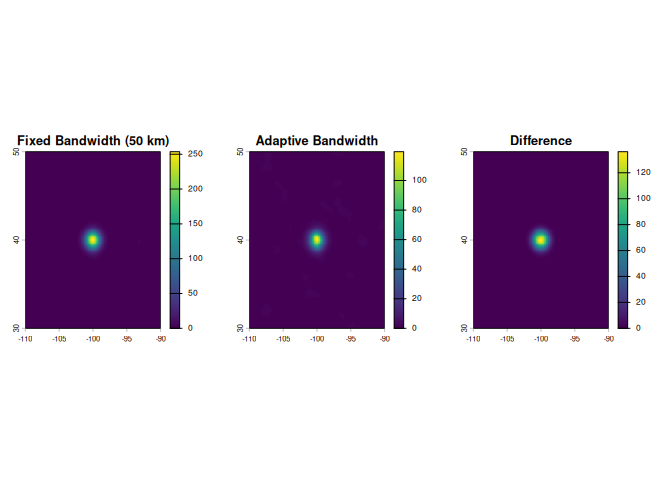
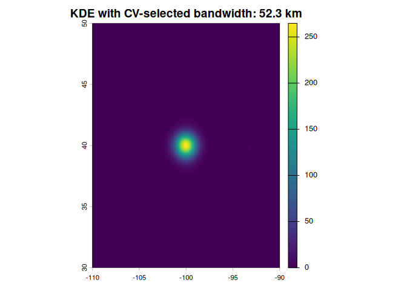

<!-- README.md is generated from README.Rmd. Please edit that file -->

# geodensity

<!-- badges: here -->

Fast kernel density estimation on geographic grids using geodesic
(great-circle) distances.

## Why geodesic KDE?

Traditional kernel density estimation uses Euclidean distance, which is
inappropriate for geographic data on a sphere. The `geodensity` package
computes distances using the **Haversine formula**, accurately
accounting for Earth’s curvature without the need to reproject data into
planar coordinate systems.

The implementation is optimized for speed, parallelizing computation
across CPU cores using Rust’s Rayon library. Typical analyses with
thousands to millions of points complete in seconds to minutes.

## Installation

``` r
# Install from GitHub (when available)
remotes::install_github("brownag/geodensity")
```

## Example: Ship Track Across the Pacific

To demonstrate geodesic correctness with spatially structured data,
consider AIS (ship position) data from a vessel crossing the Pacific
Ocean. Dense point clusters occur where the ship moved slowly or was
stationary, while sparse points mark fast transit segments. This example
crosses the international dateline seamlessly.

``` r
library(geodensity)
library(terra)
#> terra 1.8.86

# Simulate dense AIS data from a ship crossing the Pacific
# Many points per location with jitter to simulate tracking updates and GPS uncertainty
# Latitudinal error is exaggerated for clarity in "wide" visualization spanning -180 to 180 degrees

# Fast transit (sparse points with minimal jitter)
fast1 <- data.frame(
  lon = rnorm(3000, mean = 140, sd = 0.5),
  lat = rnorm(3000, mean = 15, sd = 2)
)

# Slow/stopped segment (much denser cluster)
slow1 <- data.frame(
  lon = rnorm(30000, mean = 148, sd = 1),
  lat = rnorm(30000, mean = 15, sd = 3)
)

# Fast transit
fast2 <- data.frame(
  lon = rnorm(4000, mean = 156, sd = 0.5),
  lat = rnorm(4000, mean = 15, sd = 2)
)

# Another slow/stopped segment
slow2 <- data.frame(
  lon = rnorm(35000, mean = 165, sd = 1.2),
  lat = rnorm(35000, mean = 15, sd = 3.5)
)

# Major cluster EXACTLY ON the dateline (will split left/right on map)
dateline_cluster <- data.frame(
  lon = rnorm(40000, mean = 180, sd = 2),
  lat = rnorm(40000, mean = 15, sd = 3)
)

# Cross the dateline with sparse points
crossing <- data.frame(
  lon = c(rep(170, 100), rep(173, 100), rep(176, 100), rep(-176, 100), rep(-173, 100), rep(-170, 100)),
  lat = rnorm(600, mean = 15, sd = 1)
)

# Slow/stopped segment on the eastern side
slow3 <- data.frame(
  lon = rnorm(32000, mean = -162, sd = 1.2),
  lat = rnorm(32000, mean = 15, sd = 3.5)
)

# Final fast transit
fast3 <- data.frame(
  lon = rnorm(3500, mean = -150, sd = 0.5),
  lat = rnorm(3500, mean = 15, sd = 2)
)

# Combine all segments
pts <- rbind(fast1, slow1, fast2, slow2, dateline_cluster, crossing, slow3, fast3)
pts_vec <- terra::vect(pts, geom = c("lon", "lat"), crs = "OGC:CRS84")

# Create a full world template raster from -180 to 180
# Expanded latitude range to show density patterns clearly
template <- terra::rast(
  extent = c(-180, 180, 0, 30),
  resolution = 0.25,
  crs = "OGC:CRS84"
)

# Compute kernel density with sharp bandwidth to show individual clusters
dens <- kde_geodesic(pts_vec, template, bandwidth = 100)
#> Computing geodesic KDE: 148100 points, 172800 grid cells, 100.0 km bandwidth

# Visualize
plot(dens, main = "AIS Ship Track Across Pacific\n(100 km bandwidth, ~148,000 positions)")
```


The map demonstrates geodesic correctness: the large cluster centered
exactly on +/-180 degrees appears split between the right edge (positive
180 degrees) and left edge (negative -180 degrees), even though it is
geographically a single cohesive point cluster. The densest peaks show
periods of slow or stationary movement, while transit segments appear as
low-density corridors. Euclidean methods would fail catastrophically
here, treating the left and right edges as being on opposite sides of
the planet.

## Performance

Computation is parallelized across all available CPU cores. Memory usage
is proportional to the grid size (the output raster), not the number of
input points, making the algorithm suitable for processing very large
point datasets.

Runtime depends on grid resolution, the number of input points, and
bandwidth. The spatial indexing used internally scales well: increasing
point count generally has less impact on execution time than increasing
grid resolution, as points beyond the bandwidth are automatically
skipped. Bandwidth also affects performance (larger bandwidths require
searching more nearby grid cells), but this relationship is sublinear.
For typical analyses with thousands to millions of points and moderate
resolutions, computation completes within seconds to minutes on standard
hardware.

## Adaptive Bandwidth

For datasets with highly variable point density, the `kde_adaptive()`
function scales the bandwidth inversely with local density, producing
finer detail in high-density regions and smoother estimates in sparse
regions. This “balloon estimator” approach often yields better results
for multi-scale point patterns (e.g., urban centers surrounded by sparse
rural areas, marine hotspots in vast oceans).

``` r
# Create sample data with variable density
set.seed(42)
dense_cluster <- data.frame(
  lon = rnorm(500, mean = -100, sd = 0.5),
  lat = rnorm(500, mean = 40, sd = 0.5)
)
sparse_region <- data.frame(
  lon = runif(100, -110, -90),
  lat = runif(100, 30, 50)
)
pts_adaptive <- rbind(dense_cluster, sparse_region)
pts_adaptive_vec <- terra::vect(pts_adaptive, geom = c("lon", "lat"), crs = "EPSG:4326")

template_adaptive <- terra::rast(
  extent = c(-110, -90, 30, 50),
  resolution = 0.1,
  crs = "EPSG:4326"
)

# Compute adaptive and fixed density for comparison
dens_fixed <- kde_geodesic(pts_adaptive_vec, template_adaptive, bandwidth = 50)
#> Computing geodesic KDE: 600 points, 40000 grid cells, 50.0 km bandwidth
dens_adaptive <- kde_adaptive(pts_adaptive_vec, template_adaptive, pilot_bandwidth = 50, min_bandwidth = 5)
#> Computing adaptive geodesic KDE: 600 points, 40000 grid cells, 50.0 km pilot bandwidth, 5.0 km min bandwidth

# Visualize comparison
par(mfrow = c(1, 3))
plot(dens_fixed, main = "Fixed Bandwidth (50 km)")
plot(dens_adaptive, main = "Adaptive Bandwidth")
plot(dens_fixed - dens_adaptive, main = "Difference")
```



The algorithm uses a two-pass approach: (1) compute initial density with
fixed pilot bandwidth, (2) scale bandwidth at each grid cell inversely
with the pilot density, ensuring high-density regions get small kernels
(detail) and sparse regions get large kernels (smoothness).

## Bandwidth Selection

Choosing an appropriate bandwidth is critical for kernel density
estimation. The `bandwidth_optimize()` function uses **leave-one-out
cross-validation** to select an optimal bandwidth automatically:

``` r
# Select optimal bandwidth via cross-validation
bw_cv <- bandwidth_optimize(
  pts_adaptive_vec,
  bandwidth_min = 5,
  bandwidth_max = 200,
  n_bandwidths = 12,
  verbose = TRUE
)
#> Evaluating 12 bandwidth values via leave-one-out cross-validation...
#> 
#> Bandwidth evaluation results:
#>   Bandwidth 5.0000 km: LL = -7.6625
#>   Bandwidth 6.9922 km: LL = -7.3510
#>   Bandwidth 9.7781 km: LL = -7.1404
#>   Bandwidth 13.6740 km: LL = -6.9122
#>   Bandwidth 19.1222 km: LL = -6.5942
#>   Bandwidth 26.7411 km: LL = -6.2795
#>   Bandwidth 37.3956 km: LL = -5.9592
#>   Bandwidth 52.2953 km: LL = -5.8230 <-- OPTIMAL
#>   Bandwidth 73.1315 km: LL = -5.9075
#>   Bandwidth 102.2696 km: LL = -6.1536
#>   Bandwidth 143.0172 km: LL = -6.5167
#>   Bandwidth 200.0000 km: LL = -6.9347
#> 
#> Optimal bandwidth: 52.2953 km

# Use selected bandwidth for final density estimate
dens_optimal <- kde_geodesic(pts_adaptive_vec, template_adaptive, bandwidth = bw_cv$bandwidth_opt)
#> Computing geodesic KDE: 600 points, 40000 grid cells, 52.3 km bandwidth
plot(dens_optimal, main = paste("KDE with CV-selected bandwidth:", round(bw_cv$bandwidth_opt, 2), "km"))
```



The function evaluates a sequence of candidate bandwidths and computes
the leave-one-out log-likelihood for each. The bandwidth maximizing
average log-likelihood is selected. This is statistically principled but
computationally intensive; for large datasets, consider using fewer
bandwidth candidates to reduce computation time.

**Quick reference:** Silverman’s rule-of-thumb provides a reasonable
starting point: h = 1.06 \* sigma \* n^(-1/5) where sigma is the
standard deviation of coordinates and n is the point count. However,
cross-validation often selects smaller bandwidths than Silverman’s rule,
particularly for clustered data.

## References

- Haversine formula: <https://en.wikipedia.org/wiki/Haversine_formula>
- Kernel density estimation:
  <https://en.wikipedia.org/wiki/Kernel_density_estimation>
